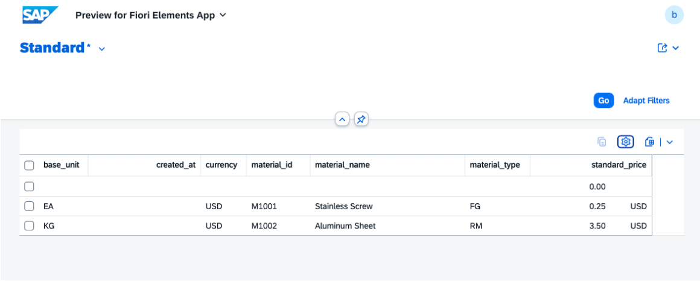
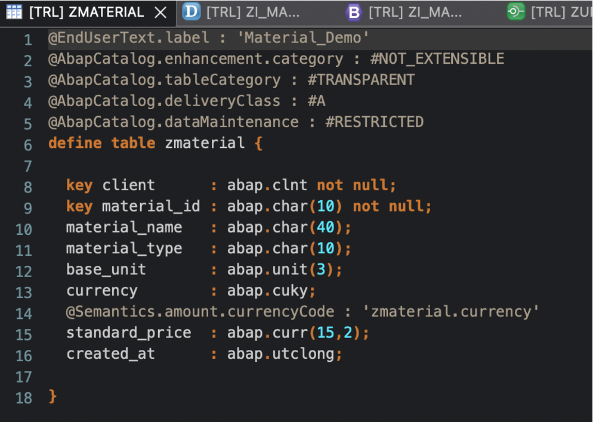
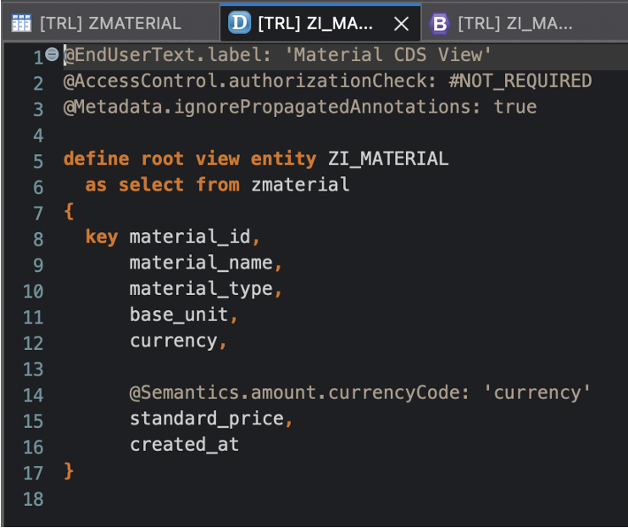

# SAP ABAP RAP Demo – Material Management

A small end-to-end RAP (RESTful ABAP Programming) project built on **SAP BTP ABAP Environment (Trial)**, demonstrating data modeling, behavior definition, and OData service exposure for a Fiori app.

## 🎯 Objective
Showcase adaptability and fast learning in implementing a new domain skill (ABAP Cloud + RAP) within 2 days.

## 🖼️ Demo Results

**Fiori Elements UI**

**Database Structure**

**CDS view**

